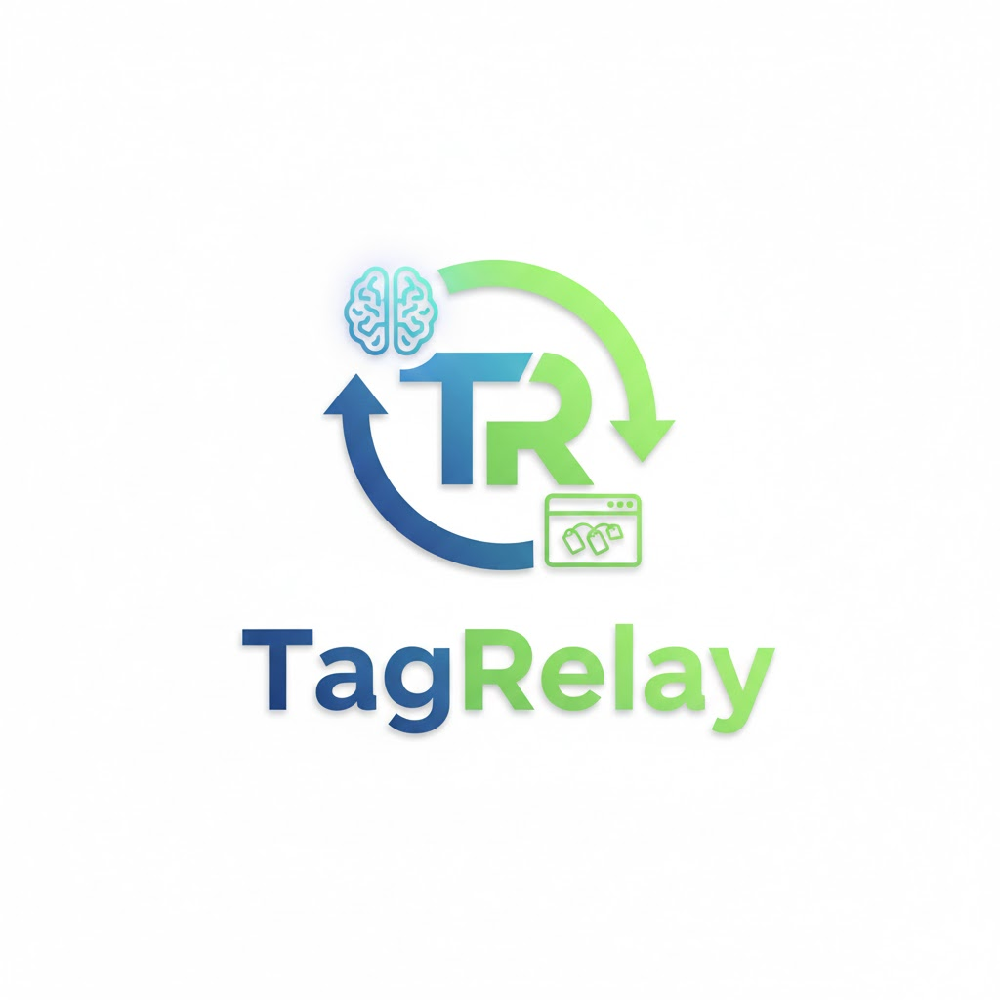

<p align="center">
  
</p>

<h1 align="center">TagRelay</h1>

<p align="center">
  <strong>Tag elements in your browser. Pull them into your AI assistant. That's it.</strong>
</p>

<p align="center">
  
  
  = 18">
</p>

---

## How it works

> **Chrome Extension** &rarr; you tag elements on any webpage
>
> **MCP Server** &rarr; holds the tagged data locally
>
> **AI Assistant** &rarr; picks up the tags via MCP tools and knows exactly what you're pointing at

No copy-pasting selectors. No screenshots. Just click what you want changed, then tell your AI what to do with it.

---

## Quick Start

### Step 1 &mdash; Build the MCP Server

```bash
cd mcp-server
npm install
npm run build
```

### Step 2 &mdash; Register with your AI Assistant

Add the TagRelay MCP server to your tool's config. The JSON block is the same everywhere — only the file location differs:

| Tool | Config location |
|------|----------------|
| **Claude Code** | Auto-detected from `.mcp.json` in this repo — just open the project and accept the prompt |
| **Claude Desktop** | `claude_desktop_config.json` |
| **Cursor** | `.cursor/mcp.json` in your project or global Cursor settings |
| **Windsurf** | `~/.codeium/windsurf/mcp_config.json` |
| **Cline** | `cline_mcp_settings.json` (VS Code settings) |
| **Antigravity** | `~/.gemini/antigravity/mcp_config.json` (or via MCP Servers panel in editor) |
| **OpenCode** | `~/.config/opencode/opencode.json` or `opencode.json` in project root |

For tools that require manual config, add this block:

```json
{
  "mcpServers": {
    "tagrelay": {
      "command": "node",
      "args": ["<full-path-to-repo>/mcp-server/dist/index.js"],
      "env": {
        "TAGRELAY_PORT": "7890"
      }
    }
  }
}
```

> Replace `<full-path-to-repo>` with the actual absolute path to this repo on your machine.

### Step 2.5 &mdash; (Optional) Add the workflow prompt

Claude Code users get this automatically via the bundled `/tagrelay` skill. For other tools, copy the prompt from [`tagrelay-prompt.md`](tagrelay-prompt.md) into your tool's custom instructions or system prompt so it knows how to use the MCP tools.

### Step 3 &mdash; Load the Chrome Extension

1. Go to `chrome://extensions`
2. Toggle on **Developer mode** (top right)
3. Click **Load unpacked** and select the `chrome-extension/` folder

You're ready to go.

---

## Usage

| Action | How |
|--------|-----|
| **Enter tagging mode** | Click the floating button in the bottom-right corner of any page |
| **Tag an element** | Hover to highlight, click to tag &mdash; a numbered badge appears |
| **Untag an element** | Click a tagged element again |
| **Clear all tags** | Use the "Clear All" button while in tagging mode |
| **Exit tagging mode** | Click the floating button again &mdash; tags stay visible |

Once you've tagged what you need, your AI assistant can pick them up using these MCP tools:

| Tool | What it does |
|------|--------------|
| `tagrelay_get_status` | Returns how many elements are tagged and on which pages |
| `tagrelay_get_tagged_elements` | Returns full data for each tag &mdash; CSS selector, text, HTML snippet, bounding box, page URL |
| `tagrelay_clear_tags` | Clears everything and removes badges from the browser |

---

## Extension Settings

Click the TagRelay icon in your Chrome toolbar:

| Setting | Default | Description |
|---------|---------|-------------|
| **Server Port** | `7890` | Must match `TAGRELAY_PORT` in your MCP config |
| **Element Screenshots** | Off | When on, each tag includes a cropped PNG of the element |

---

## Project Structure

```
TagRelay/
  chrome-extension/       Chrome Extension (Manifest V3, vanilla JS)
    manifest.json
    content.js            Tagging UI injected into every page
    content.css           Styles for badges, highlights, floating button
    background.js         Service worker for screenshot capture
    popup.html/js/css     Settings popup
    icons/                Extension icons
  mcp-server/             MCP Server (Node.js + TypeScript)
    src/
      index.ts            Entry point — stdio MCP + HTTP server
      store.ts            In-memory tag storage
      http-server.ts      REST + SSE endpoints for Chrome extension
      tools.ts            MCP tool definitions
```
